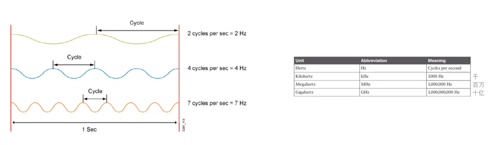
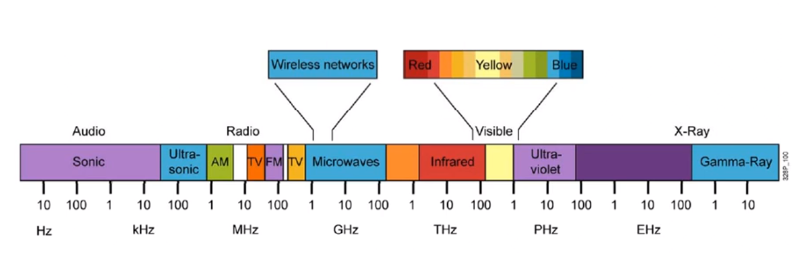
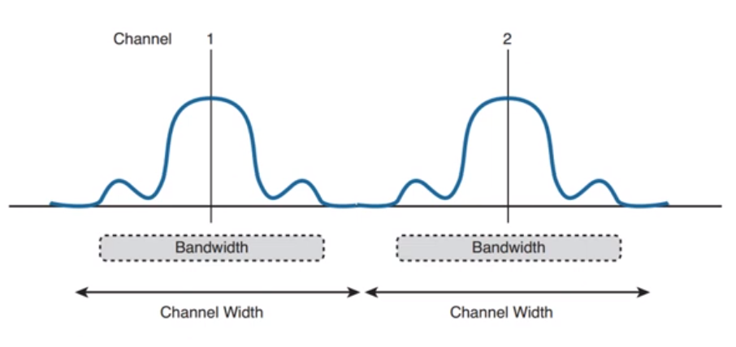
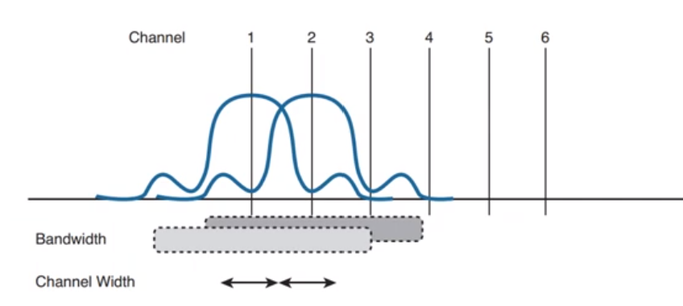

Frequency
===
🔙 [MENU README](./README.md)

# Frequency

1. 通常3kHz~300GHz的範圍稱為RF(Ratio Frenquency)
2. RF區間包含很多類型的無線電通信
   低頻無線電、AM無線電、短波無線電、電視、FM無線電、微波、雷達
3. Microwaves頻率包含WLAN的頻率區間
   - 2.4GHz
   - 5  GHz

# 2.4G Channel

1. 2.4G頻段中(2.402GHz ~ 2.483GHz)，有1~14個頻道，**每個頻道之間的間隔為5HMz**(因為有帶寬)
    理想狀況下的Bandwith
    {:height="200px" width="300px"}
    現實狀況下的Bandwidth
    {:height="200px" width="300px"}
2. 每個頻道有效帶寬為22MHz。實際運用中，有效帶寬為20MHz，其中有2MHz是隔離用的，且有些法規問題14個頻道不能全部使用
3. 相鄰的頻道之間有重疊，盡量不要同時使用，這也是推5G的原因，其中有三個不重疊的頻道 : 
  1、6、11 
  2、7、12
  3、8、13

