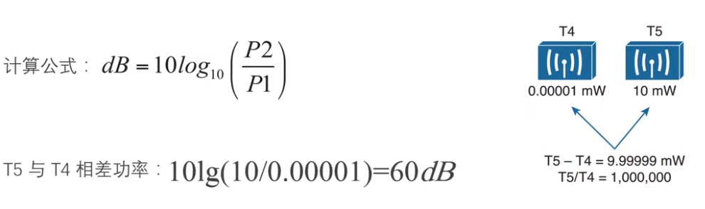
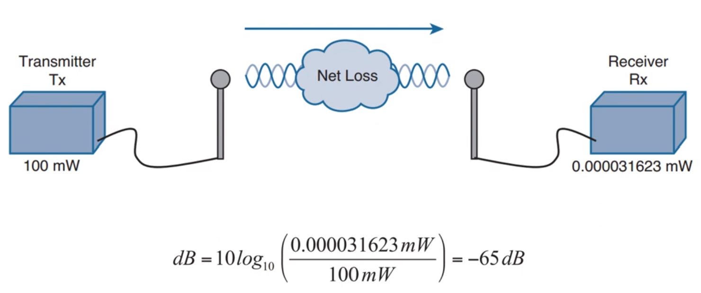
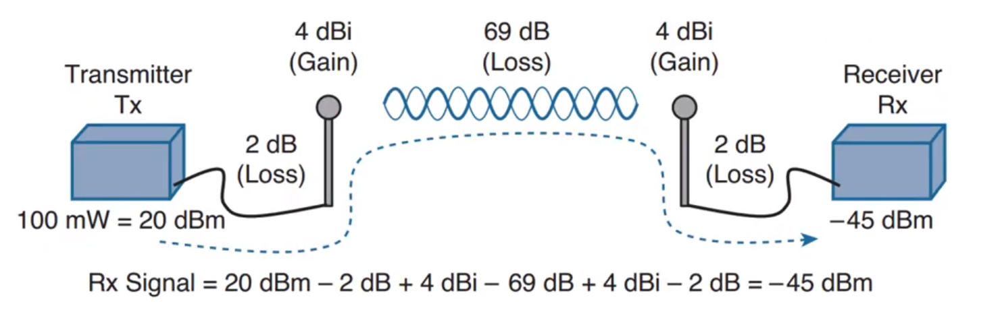
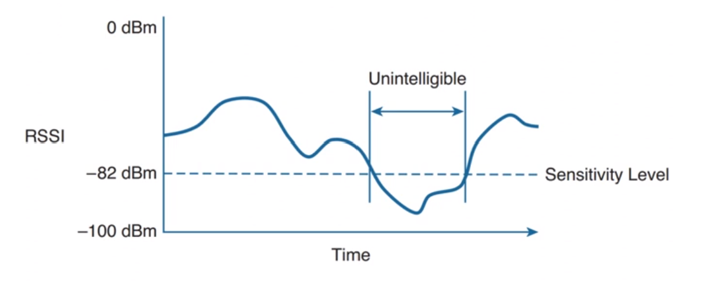

Power
===
🔙 [MENU README](./README.md)
> 無線電波的功率

# RF Power
1. RF信號必須以足夠的強度或能量進行發送，這裡強度是以振幅(Amplitude)來度量的
2. RF強度通常以功率度量，單位瓦(W)
3. AP訊號強通常在 0.001W(1mW) ~ 0.1W(100mW)之間
4. dB計算功率
    dB(decibel，分貝)最初用來對比聲音強度，也可以直接用於功率
    

# Power Loss
1. 計算功率損耗，但中間加減不便

2. 基準值比對功率: dBm
   通常將基準功率定為1mW，此時的功率單位為dBm(dB-milliwatt，分貝-毫瓦)
   

---

# RSSI 接受信號強度指示
1. 接收端用RSSI(Received Signal Strength Indicator)來度量信號功率，單位為dBm
2. AP的功率強度通常在100mW ~ 1mW 之間
   也就是 20dBm ~ 0dBm 之間
3. 在接收端大約在 1mW ~ 0mW 之間
   也就是 RSSI 在 0dBm ~ -100dBm 之間
   越靠近 0 信號越好，反之低於 -82dBm(網卡感知級別) 就開始影響收訊

