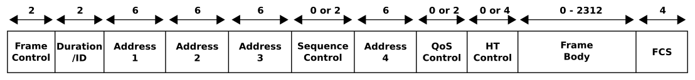

802.11 Frame Type
===
🔙 [MENU README](./README.md)

# Frame Type
1. 802.11標準定義了三種Frame Type
   - Data Frame
   - Control Frame
   - Management Frame
2. Frame Type 到底是哪種是由頭部的 Frame Control(2Bytes) 和其中的SubType(4 Bytes)標示
Frame Type

Frame Type => Frame Control

---

# Data Frame
- 發送出去的數據都存於Data Frame
- 最多可以包含4個地址段
  - SRC
  - DST
  - BSSID
  - 轉發的Link
{:height="300px" width="500px"}

---

# Control Frame
- 獲取對信道的控制，並幫助設備通過信道傳輸數據
- Control Frame包含Frame頭部訊息，但沒有數據

---

# Management Frame
1. Beacon
   - AP 以**廣播**方式告訴大家自己的基本訊息:包含BSS、BSS允許的速率
   - Beacon以每秒鐘10次的頻率發送給BSS中的所有設備，等待設備來連接(每個設備速率不太一樣)
   - 這就是在搜尋附近可用網路的時候會看到的可用網路訊息
   
2. Probe
   - 無線設備可以向所處範圍內的所有AP或指定AP發送請求，以要求AP提供他們的BSS信息
   - 探測BSS信息的過程稱為主動掃描
   
3. Authentication and Deauthentication
   - 無線設備要加入某BSS，必須先向AP發送一個Authentication Frame
   - 無線設備席開已認證狀態，可向AP發送Deauthentication Frame
   - AP也可以向無線設備發送Deauthentication Frame強制離開認證狀態
     **AP發送的Deauthentication Frame不需要加密也不用任何校驗，所以可以無償踢人，讓人重新驗證以捕獲關鍵訊息**
   
4. Associate、disassociate、reassociation