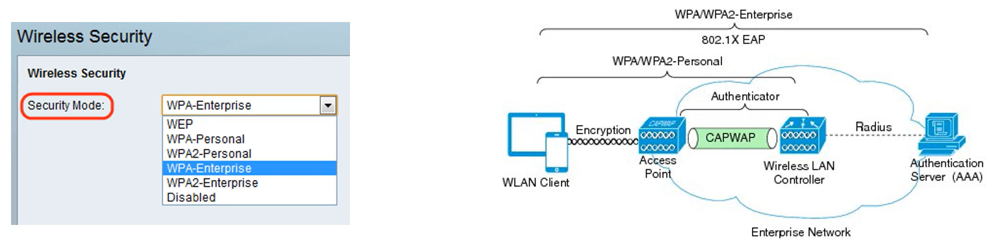
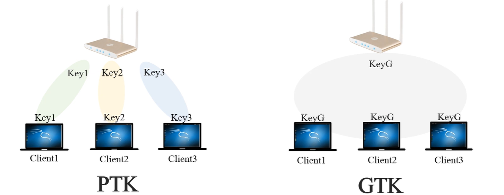
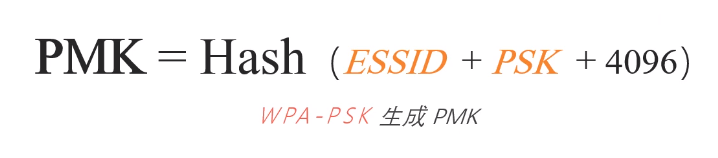
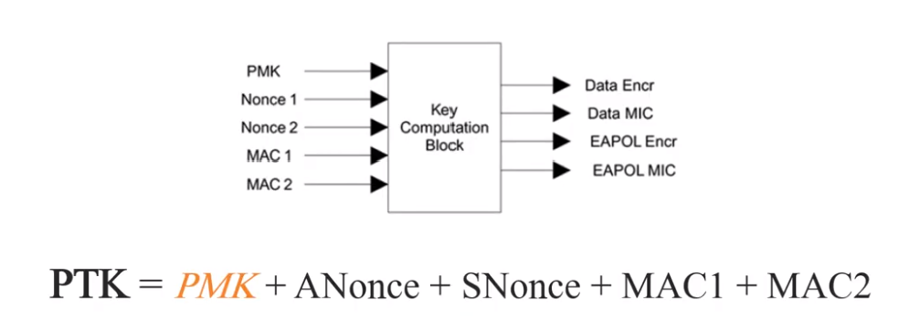

Encryption
===
🔙 [MENU README](./README.md)

---

# WEP
1. Wire Equivalent Privacy，有線等效保密
2. 被用來提供和有線LAN同等級的安全性，LAN天生比WLAN安全
3. 2003年被WPA(WiFi Protected Access)淘汰，接著又在2004由IEEE 802.11i標準(WPA2)所取代

---

# WPA
1. WiFi Protected Access，WiFi保護訪問
   - WPA
   - WPA2
2. 安全類型
   - WPA個人 : 使用PSK(Pre-shared key)實現身分驗證(WiFi密碼)
   - WPA企業 : 使用802.1x和3A服務器實現身分驗證
   
3. 密鑰交換
   - 無線網路設計用於一組無線設備通信，單播、廣播、組播安全特性要求不同
   - 單播 : 通信需要**單獨密鑰**加密通信雙方流量Pairwise Transient Key(成對傳輸密鑰PTK)
   - 組播、廣播 : 通信需要信任域內所有成員**共享同一密鑰**Group Temporal Key(臨時組密鑰 GTK)
   
4. PMK
   - Pairwise Master Key，成對主密鑰
   - PTK和GTK都是通過PMK派生
   - PMK是一個256位的HASH
   - Client和AP分別計算PMK、PMK並不在網路上面傳輸
   
      > ESSID : WIFI名稱
      > PSK   : WIFI密碼
      > 4096  : 疊代算法
5. PTK
   - Pairwise Transient Key，成對傳輸密鑰
   - 是由2個隨機數、2個MAC address(Client、AP)通過散列計算得到
   - 也是一個HASH，但根據算法不同長度不同
   
      > 算出PTK後再進行一個計算可得到兩對密鑰
      > 1. Data Encr(數據加密) 、 Data MIC(完整性校驗)
      > 2. EAPOL Encr(Protocal) 、 EAPOL MIC
6. 四次握手生成PTK
   - 隨機數在此產生，且全程是明文傳輸
   
   - STA : PTK = PMK + **ANounce** + SNounce + MAC1 + MAC2
   - AP  : PTK = PMK + ANounce + **SNounce** + MAC1 + MAC2
   - MIC = HASH(PTK)
   - MIC(STA) = MIC(AP) 驗證成功
   - AP發GTK + MIC
   - STA回ACK有收到，沒收到則AP會重發一次GTK + MIC，**因為無線網路干擾很多所以才有這個機制**