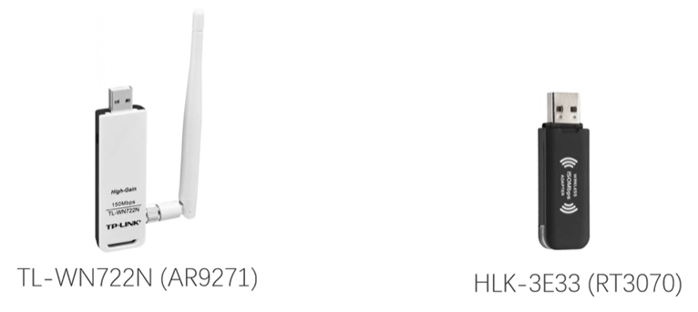

Common
===
🔙 [MENU README](./README.md)


# 網卡選購
Kali Linux再找尋適合的網卡驅動是十分麻煩的
有的不能注入，有的不能監聽
以下三款支援隨插即用
1. Atheros AR9271 (神器)
2. Ralink RT3070
3. Realtek RTL818L


{:height="200px" width="400px"}

Function Test
```bash
iw list
# IBSS
# managed
# AP          ===> 可以偽裝AP
# AP /VLAN
# monitor     ===> 可以抓包
# mesh point
# P2P-client
# P2P-GO
# outside context od a BSS


# 注入功能測試
sudo aireplay-ng -9 wlan0mon


Trying broadcast probe requests...  # ===> WEP Attack
Injection is working                # ===> 可以注入包

```
Card to Card Test
```bash
# 一個當AP 一個當Client
sudo aireplay-ng -9 -i wlan0mon wlan1mon


11:03:32  Trying broadcast probe requests...
11:03:32  Injection is working!
11:03:34  Found 1 AP 

11:03:34  Trying directed probe requests...
11:03:34  F0:9F:C2:AA:19:29 - channel: 1 - 'wifi-old'
11:03:34  Ping (min/avg/max): 0.232ms/4.545ms/15.496ms Power: -29.00
11:03:34  30/30: 100%


11:03:34  Trying card-to-card injection...
11:03:34  Attack -0:           OK
11:03:34  Attack -1 (open):    OK
11:03:34  Attack -1 (psk):     OK
11:03:34  Attack -2/-3/-4/-6:  OK
11:03:39  Attack -5/-7:        Failed
```
```
插入網卡後需要先加入USB Controller再加入USB裝置
```

---

# Common terms
```
AP    - Access Point
STA   - Station無線工作站
SSID  - Service Set ID 服務識別碼，便於用戶辨識
BSSID - Basic Service Set ID 基礎服務識別碼，本質是AP的MAC Address  
```

# Network Interface Mode
1. Ad-Hoc
    節點互相連接，無須路由器即可共享資源(跟現在的WIFI-Direct類似)
2. Managed
    最常用的模式，連接到基地台，並只接受該AP的資料
3. Master
    充當存取點(俗稱基地台)，其他節點可以連接，也就是我們今日說的WIFI熱點
4. Monitor
    混亂模式，此模式不會連接到任何節點或AP，但可以監控特定範圍中的所有資料包


---

# Command
```bash
iwconfig           # 列出無線網卡
iw wlan2 link      # 檢查連接

sudo iw wlan2 scan # wlan2可以連接哪些wifi
sudo iw wlan2 scan | grep SSID:
```
conf
```bash
# wpa_supplicant.conf

network={
    ssid="wifi-guest"
    key_mgmt=NONE
}
```
Connect WIFI
```bash
sudo wpa_supplicant -Dnl80211 -iwlan2 -c wpa_supplient.conf

# wpa_supplicant : 用於連接 WPA-PSK/WPA2-PSK 加密的 Wi-Fi 網絡的工具
# -D : 指定要使用的驅動程序類型
# -i : 指定要配置的無線網絡介面
# -c : 指定配置文件的路徑
#      配置文件包含要連接的無線網絡的詳細信息
#      如 SSID、密碼、加密類型等


# 出現 CTRL-EVENT-CONNECTED 代表成功連結WIFI
Successfully initialized wpa_supplicant
wlan2: SME: Trying to authenticate with f0:9f:c2:71:22:10 (SSID='wifi-guest' freq=2437 MHz)
wlan2: Trying to associate with f0:9f:c2:71:22:10 (SSID='wifi-guest' freq=2437 MHz)
wlan2: Associated with f0:9f:c2:71:22:10
wlan2: CTRL-EVENT-CONNECTED - Connection to f0:9f:c2:71:22:10 completed [id=0 id_str=]
```
Get IP
```bash
sudo dhclient -v wlan2

# DHCPACK 192.168.10.84
DHCPACK of 192.168.10.84 from 192.168.10.1 (xid=0x3e18d051)
# 而有些企業會設定不是公司內部註冊的MAC，會無法取得IP以保資安

# 可以打開瀏覽器連結 http://192.168.10.1
```

---

# Tool Study
1. Aircrack-ng
   - Monitoring
   - Attacking
   - Testing
   - Cracking
```bash
airmon-ng # 網卡資訊
```
Monitor Mode
```bash
# 切換成Monitor Mode模式 否則是抓不到任何封包的
airmon-ng check  # 查看會影響Monitor模式的Process
kill $id
service $service_name stop
airmon-ng check kill # 上面檢測到的Process全部刪除

airmon-ng start wlan0
airmon-ng stop  wlan0mon
ifconfig wlan0 up # 停用monitor模式後，網卡會down需手動開啟

airmon-ng start wlan0 1 # 進入monitor並處於Channel 1
iwlist wlan0mon channel # 查看目前是在哪個Channel
```
Function Test
```bash
aireplay-ng --help
# 0~9有不同的功能

# 注入功能測試
aireplay-ng -9 wlan0mon
```
抓包
```bash
airodump-ng wlan0mon

# BSSID  : AP 的 MAC
# PWR    : RSSI網卡的接受信號強度指示
# Beacons: 接收到此AP發送的Beacon frame
# Data   : 抓到的Data frame數量
# #/s    : 近10s內每秒平均抓到的frame數量
# CH     : Channel從Beacon frame中獲得
# MB     : AP支持的最大速率
# ENC    : 加密演算法體系:WEP、WPA、WPA2、OPEN
# CIPHER : 加密算法:CCMP(目前最安全的加密套件)、TKIP、WEP40、WEP104
# AUTH   : 身分認證方式:MGT、PSK、SKA(WEP會顯示)、OPEN
# ESSID  : 無線網路名稱，隱藏AP的話這個就可能是空


airodump-ng wlan0mon -c 1

# RXQ    : 最近10s成功接受的frame百分比，只有在固定Channel時才會出現

# STATION: STA的MAC地址
# Rate   : 0 AP到客戶端的最後數據速率
#          1e 客戶端到AP的最後一個數據速率
# Lost   : 丟失的frame數量
# Frames : Client發送的數據包數量
# Probs  : 客戶端探測的ESSID，若能看到probe frame一般來說客戶距離我們無線網卡都挺近的


airodump-ng wlan0mon -c 1 --bssid D4:EE:07:54:7B:90 -w cap_test.cap
wireshark cap_test.cap
```