KRACK
===
🔙 [MENU README](../README.md)

> https://www.youtube.com/watch?v=lPWGZB3ytjw

```
KRACK密鑰重載攻擊
在不知道PSK的狀況下依然可以解密無線數據包，甚至竄改流量內容
```


# Introduction
1. KARCK，Key Reinstallation AttaCKs ，是2017年提出的一系列WPA2協定漏洞的總稱
2. 是一種不需要依靠密碼猜測的 WPA2 協定攻擊手段
{:height="200px" width="400px"}
```
PTK = PMK + ANounce + SNounce + MAC1 + MAC2
```
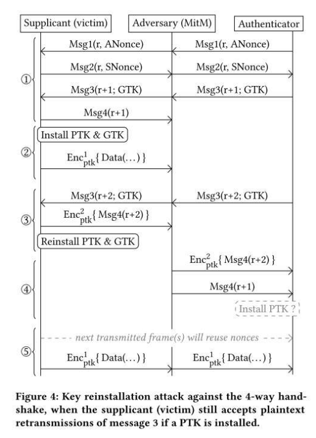{:height="200px" width="400px"}
3. 受影響的系統
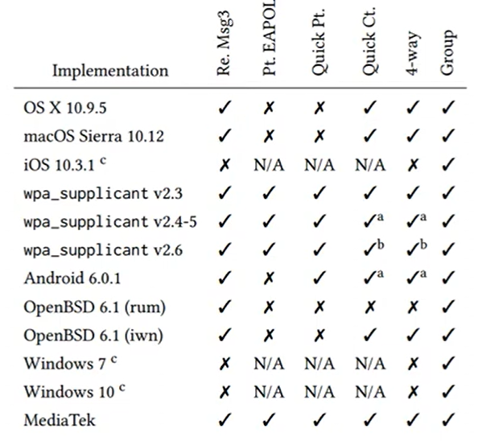{:height="400px" width="400px"}


---

# Encryption

```
運用Packet Number創造出不同的KeyStream，使每個Packet都可以被不同密鑰加密
加密中最害怕的就是數據統計，若使用一樣的KeyStream很容易找出規律
如果一直重用Nonce，就代表你的KeyStream重複了
```

---

# Reinstallation Attack
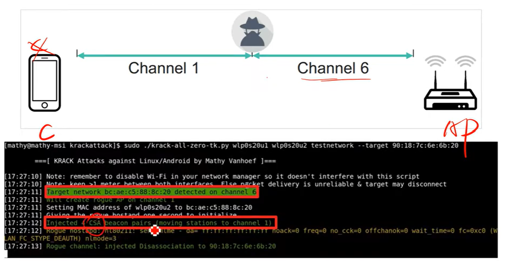
```
客戶端原本要連線到Channel 6 我們發送Deauthentication將使用者踢出去
客戶端會想重連，我們發送CSA攻擊，將客戶端連接到Channel 1
攻擊者有兩個網卡，偽裝成AP，成為中間人
```
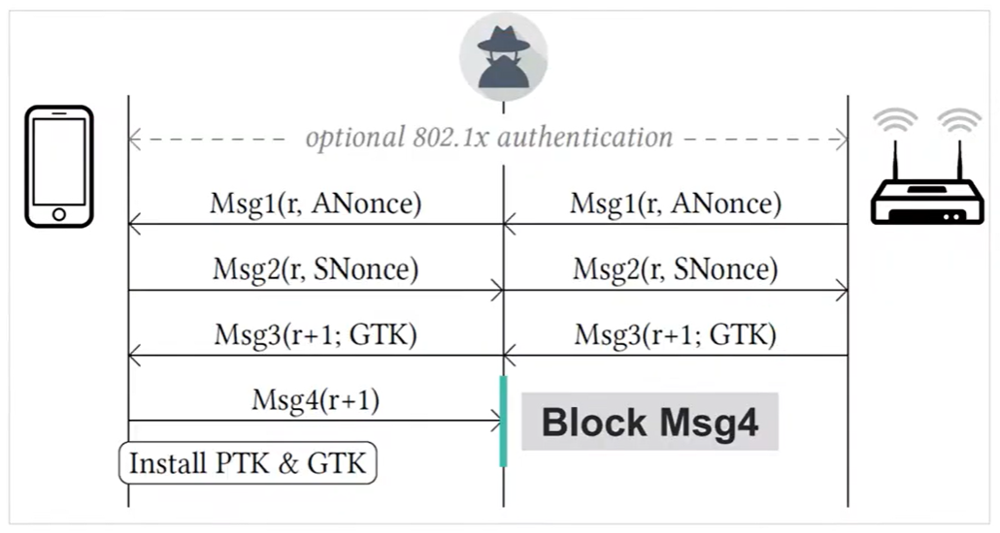
```
攻擊者阻斷Msg4(這是一個關於Msg3的ACK)
```
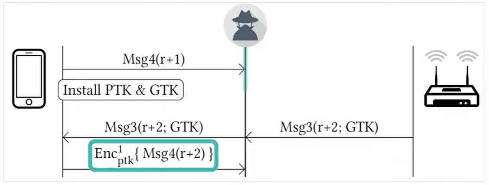
```
AP會認為我的Msg3沒有傳送成功，所以AP會再重傳一次Msg3(r+2)
但對於客戶端來說，我剛剛丟出Msg4時我的握手已經完成
他會開始使用PTK & GTK進行數據加密

客戶段感到困惑，不是已經傳過了嗎
但IEEE的規定是:只要拿到Msg3就得傳Msg4 ACK 回去
因為剛剛就加載過PTK & GTK 所以這個包是加密的
```
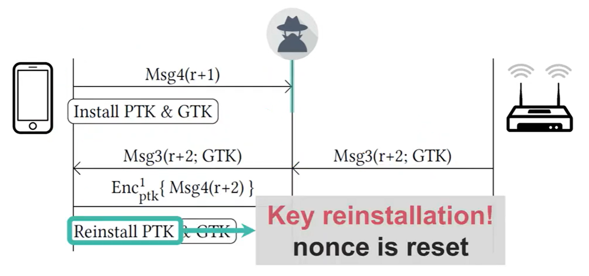
```
透過觀察可以發現 Msg4(r+1)、Enc{Msg4(r+2)} 兩次ACK的相似度是很高的

剛剛提到IEEE的規定是:只要拿到Msg3就得傳Msg4 ACK 回去
而且IEEE還有一個規定是除了要傳ACK 還必須要重載PTK 而且Nonce會重置
```
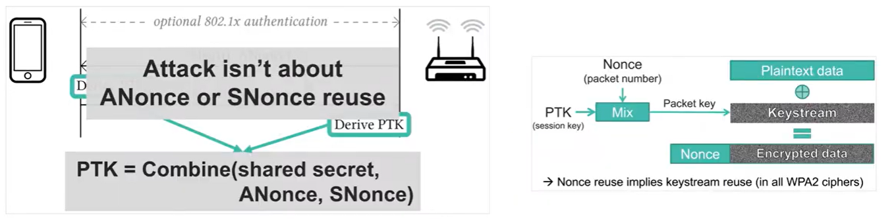
```
Nonce的重置就會造成相同的KeyStream產生
```
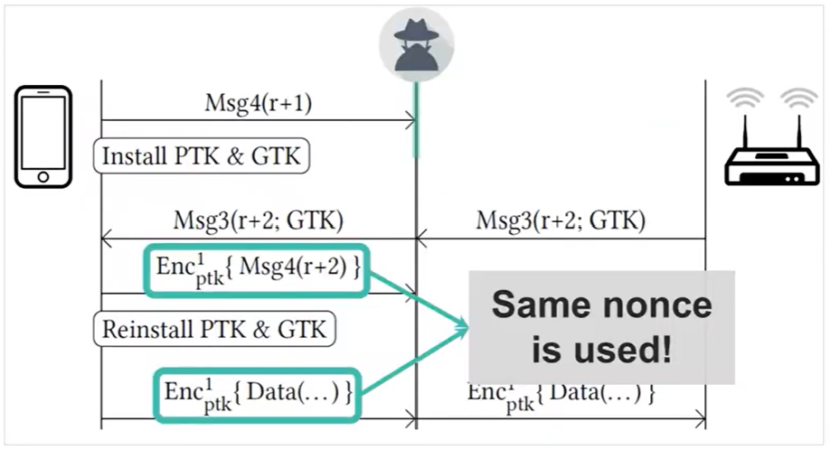
```
重載Nonce後會繼續傳輸數據，這時會發現Nonce開始重用了

```
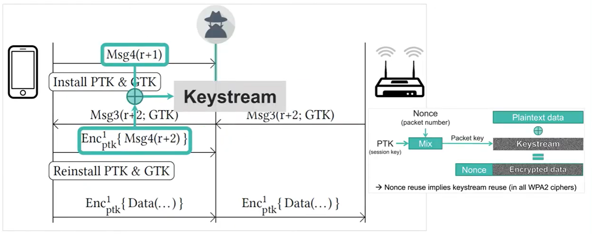
```
前面我們透過Msg4(r+1)、Enc{Msg4(r+2)}拿到一個明文對應密文的關係
只要透過XOR不就可以導回KeyStream
```
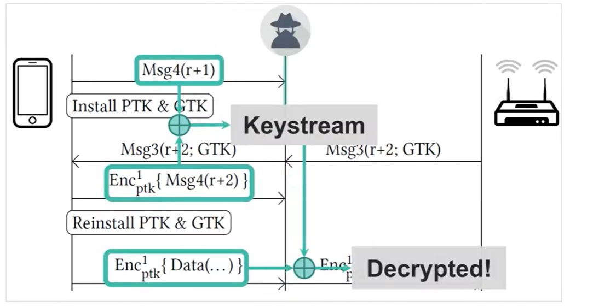
```
當我導出KeyStream我就可以解出重載過的數據了
```

---

# Mitigate
1. Client AP升級與補丁
2. WIPS(無線入侵防禦系統)，會去主動探測附近有沒有跟我一樣的SSID
   當發現有AP跟我發送一樣的SSID我就主動去Deauthentication
    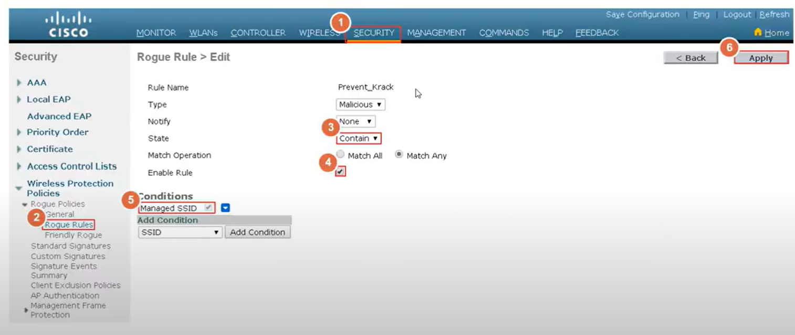
    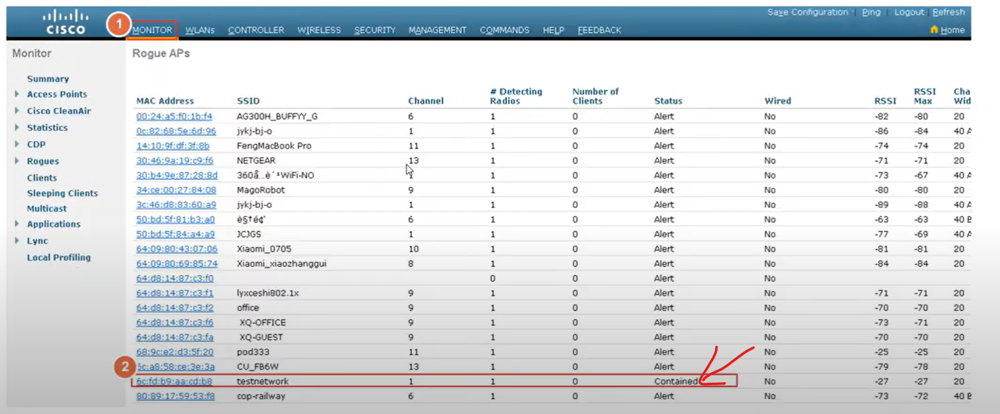

---

# CVE
```
1. CVE-2017-13077: Reinstallation of the pairwise encryption key (PTK-TK) in the 4-way handshake.
2. CVE-2017-13078: Reinstallation of the group key (GTK) in the 4-way handshake.
3. CVE-2017-13079: Reinstallation of the integrity group key (IGTK) in the 4-way handshake.
4. CVE-2017-13080: Reinstallation of the group key (GTK) in the group key handshake.
5. CVE-2017-13081: Reinstallation of the integrity group key (IGTK) in the group key handshake.
6. CVE-2017-13082: Accepting a retransmitted Fast BSS Transition (FT) Reassociation Request and reinstalling the pairwise encryption key (PTK-TK) while processing it.
7. CVE-2017-13084: Reinstallation of the STK key in the PeerKey handshake.
8. CVE-2017-13086: reinstallation of the Tunneled Direct-Link Setup (TDLS) PeerKey (TPK) key in the TDLS handshake.
9. CVE-2017-13087: reinstallation of the group key (GTK) when processing a Wireless Network Management (WNM) Sleep Mode Response frame.
10. CVE-2017-13088: reinstallation of the integrity group key (IGTK) when processing a Wireless Network Management (WNM) Sleep Mode Response frame
```

# LAB
Enviroment
```bash
sudo apt-get update
sudo apt install libnl-3-dev libnl-genl-3-dev pkg-config libssl-dev net-tools git sysfsutils python-scapy python-pycryptodome
git clone https://github.com/vanhoefm/krackattacks-scripts
# 這東西不能真的拿去攻擊，只能做測試
```
Network Configuration
```bash
cd krackattacks-scripts-research/hostapd
vim hostapd.conf
# ssid = testnetwork
# interface = wlan0 改成自己的網卡
# wpa_passphrase = abcdefgh


cp deconfig .config
make -j 2
```
禁用硬件加密
```bash
cd krackattsck
./disable-hwcrypto.sh
# Reboot Computer
```
Test
```bash
./krack-test-client.py

# 通過向Client反覆發送加密消息來測試4次握手中的密鑰重新安裝
# 測試是否重新安裝PTK & GTK

# 這時可以開啟另外一台電腦去連線 WiFi : testnetwork
# 客戶端的WiFi會一閃一閃的再重載
```